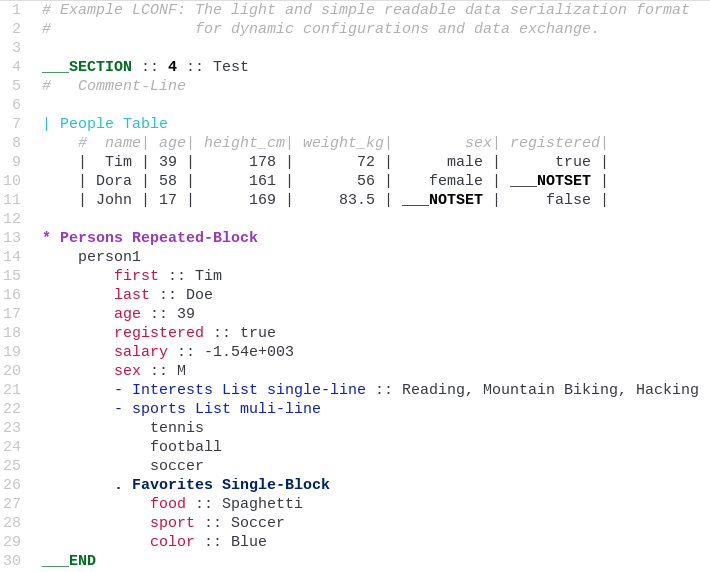

## atom-language-lconf

*atom-language-lconf* adds [LCONF](http://lconf.github.io/) language support in [Atom-Editor](https://atom.io/).

### Features

*   Syntax highlighting for [LCONF](http://lconf.github.io/) The light and simple readable data serialization format
    for dynamic configurations and data exchange.

*   Illegal syntax highlighting helps avoiding common pitfalls.

*   Snippets for common LCONF keywords and constructs (see snippets/language-lconf.cson)

    *  `:`  - LCONF-Key-Value-Separator
    *  `s`  - LCONF-Start-TAG
    *  `e`  - LCONF-End-TAG
    *  `n`  - LCONF-NOTSET
    *  `k`  - LCONF-Key :: Value Pair
    *  `-`  - LCON-List-multi-line
    *  `-s` - LCON-List-single-line
    *  `|`  - LCON-Table
    *  `.`  - LCON-Single-Block
    *  `*`  - LCON-Repeated-Block

### Installation

Installation happens normally either through `apm install atom-language-lconf` or through the install section of
the settings tab within Atom.

### Recommended Extras

*   [Atom Light UI Theme](https://github.com/atom/atom-light-ui) package is the recommendet companion UI Theme.

*   The [atom-theme-p-light-syntax](http://peter1000.github.io/atom-theme-p-light-syntax/) package is a Syntax Theme
    package a derivative of Atom's *One Light Syntax Theme* with additional syntax highlighting for the LCONF language.

### Recommended Atom Settings

*   *UI Theme*: [Atom Light](https://github.com/atom/atom-light-ui)
*    fontFamily: "Liberation Mono"
*    lineHeight: 1.3

### LCONF Language Example File

